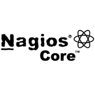
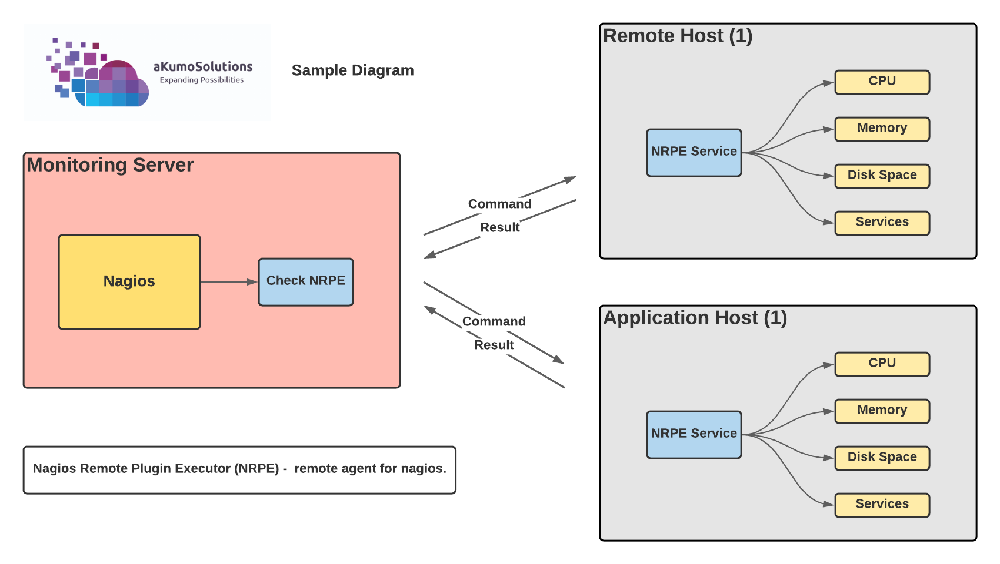

# Nagios-Core Setup on CentOS 7 

## What is Nagios Core?

  

Nagios Core is the monitoring and alerting engine that serves as the primary application around which hundreds of Nagios projects are built.

Source: www.nagios.org

## What is NRPE? 

  

Nagios Remote Plugin Executor (NRPE) is a Nagios agent that allows remote system monitoring using scripts that are hosted on the remote systems. It allows for monitoring of resources such as disk usage, system load or the number of users currently logged in.

Source: 
<a href="www.nagios.org">www.nagios.org</a>

 

## Prerequisities for Setup:

* Access to AWS 
* Terraform 0.12
* Ansible

## Folders 

[nagios_core](nagios_core) :

Contains Terraform code to setup Nagios Core server in AWS. 

[nagios_agent](nagios_agent)

Contains Ansible Playbook to install and configure NRPE is the hosts that needs to be monitored. 

## Installation 